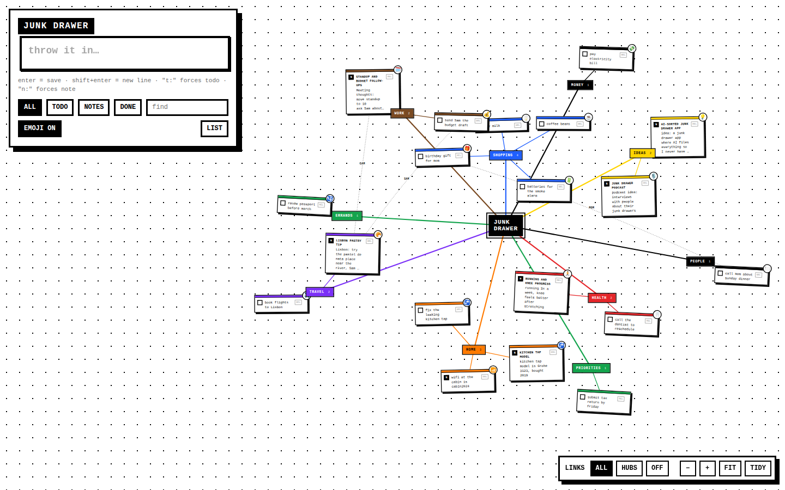
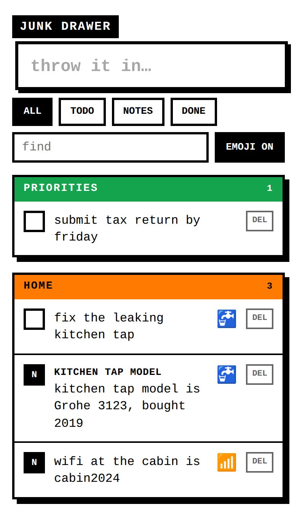

# Junk Drawer

A place to throw notes and todos without thinking about where they go. Open it, type, press enter, done. Claude sorts each entry into a **todo** or a **note** and files it in a category (shopping, work, ideas, ...).

<p align="center">
  
  
</p>
<p align="center"><em>Desktop board (left) and phone list (right)</em></p>

## How it works

- The input is focused as soon as the page opens. **Enter** saves (on the iPhone keyboard too). Shift+Enter adds a new line.
- Saving is instant. Sorting runs in the background, and the entry moves into its compartment a moment later.
- **Todo vs. note:** a todo is something you can tick off. It's usually one short line (under about 90 characters), like "buy milk", "call the dentist", or just "batteries". A note is something to keep: ideas, facts, references, or anything long or multi-line. Claude decides, and it leans on length the same way.
- To override the sorting, start with `t:` (force a todo) or `n:` (force a note).
- Claude reuses your existing categories where it can, so the drawer stays tidy.
- **Find** searches every entry. **Done** shows ticked-off todos.
- **Colour-coded categories:** health is red, shopping blue, travel purple, home orange, work brown, ideas yellow, and errands and priorities green. Close synonyms Claude might use count too (groceries → shopping, fitness → health). Other categories stay black. Change the colours in `client/src/categoryColors.ts`.
- **Emojis:** each entry gets an emoji for what it's about (milk → 🥛, dentist → 🦷), shown on the card's top-right corner. Claude picks it while sorting; with the rule-based sorter, and for entries saved before emojis existed, a built-in keyword list fills in. **EMOJI ON / OFF** turns them off on that device.
- Works offline: entries are kept on the device and sent when you're back online.
- Install it to your home screen (Safari → Share → Add to Home Screen) so it opens like an app.

## Desktop board

On a computer (wide screen and a mouse), the drawer opens as a cluttered mind-map board instead of a list. **LIST / BOARD** switches between them; phones and tablets always get the list.

- **JUNK DRAWER** sits in the middle, with one black hub per category around it and each entry's card hanging off its hub.
- A new entry hangs off the centre on a dashed line while it's being sorted, then glides to its hub.
- Drag a card to move it; drag a hub to move its whole cluster. Drag the background (or scroll) to pan; pinch or ctrl+scroll to zoom.
- **Links:** ALL also draws dotted lines between entries in *different* categories that share a word (for example "mom" in shopping and people), labelled with that word. HUBS draws only the hub lines; OFF hides lines.
- Search and filters fade non-matching cards instead of removing them, so the map keeps its shape. Ticked-off todos leave the board (see them under DONE).
- **FIT** frames everything on screen. **TIDY** undoes all your dragging.
- Where you dragged things, the zoom, and the link mode are remembered per computer (in the browser), not synced between devices.

## Stack

- **Client:** React + TypeScript, built with Vite (`client/`)
- **Server:** TypeScript on Node 22, run directly with Node's built-in type stripping (no build step). Plain `node:http`, SQLite via the built-in `node:sqlite` (`server/`)
- **Shared types:** `shared/types.ts`
- **AI:** Claude Haiku 4.5 through the Anthropic SDK, with structured JSON output

## Develop

Needs Node 22.18+.

```sh
npm install
cp .env.example .env    # optional: fill in ANTHROPIC_API_KEY
npm run dev             # API on :3000, Vite on :5173 (proxies /api)
npm test                # server + board layout tests
npm run build           # typecheck + build the client into dist/
npm start               # serve dist/ and the API on :3000
```

| env | |
|---|---|
| `ANTHROPIC_API_KEY` | Turns on AI sorting. Without it, a simple length/keyword rule sorts entries. |
| `JUNK_PASSCODE` | Passcode for the login screen. Each device stays logged in for about a year. **Set this whenever the app is reachable from outside your LAN.** |
| `JUNK_MODEL` | Claude model to use (default `claude-haiku-4-5`). |
| `JUNK_DB` | SQLite file path (default `./data/junk.db`; `/data/junk.db` in Docker). |
| `PORT` | default `3000` |

`npm run dev` reads env vars from your shell, not `.env`. Use `export $(cat .env | xargs)` or set them inline.

## Self-hosting on Proxmox

The app is one container with one SQLite file. A tiny guest is enough: 1 vCPU, 512 MB RAM, 4 GB disk.

### 1. Make a Docker host

Pick one:

- **Debian VM (simplest, most robust):** create a Debian 12 VM and install Docker with `curl -fsSL https://get.docker.com | sh`.
- **LXC container (lighter):** create a Debian 12 LXC. Under *Options → Features*, enable `nesting=1` (and `keyctl=1` for an unprivileged container). Then install Docker the same way.

### 2. Run it

```sh
git clone https://github.com/phuoc/junkdrawer.git && cd junkdrawer
cp .env.example .env && nano .env     # set ANTHROPIC_API_KEY and JUNK_PASSCODE
docker compose up -d --build
```

It's now on `http://<guest-ip>:3000`. Data lives in the `junkdata` Docker volume, which survives rebuilds.

Update:

```sh
git pull && docker compose up -d --build
```

### 3. HTTPS and reaching it from your phone / work computer

The iPhone home-screen app, the offline cache (service worker) and the secure login cookie all need **HTTPS**. Two good options:

- **Tailscale (recommended for personal use):** install Tailscale on the guest and your devices, then run `tailscale serve --bg 3000` on the guest. You get `https://<guest>.<tailnet>.ts.net` with a real certificate, reachable only by your own devices. Nothing is exposed to the internet. Work computers that can't run Tailscale won't reach it this way.
- **Reverse proxy (public):** put Caddy, Nginx Proxy Manager or a Cloudflare Tunnel in front of port 3000 with your domain. The app trusts `X-Forwarded-Proto: https` to mark the login cookie `Secure`. With this option, always set a strong `JUNK_PASSCODE`.

### 4. Backups

Include the guest in a Proxmox backup job (*Datacenter → Backup*), or copy the database out:

```sh
docker cp junkdrawer:/data/junk.db ./junk-$(date +%F).db
```
